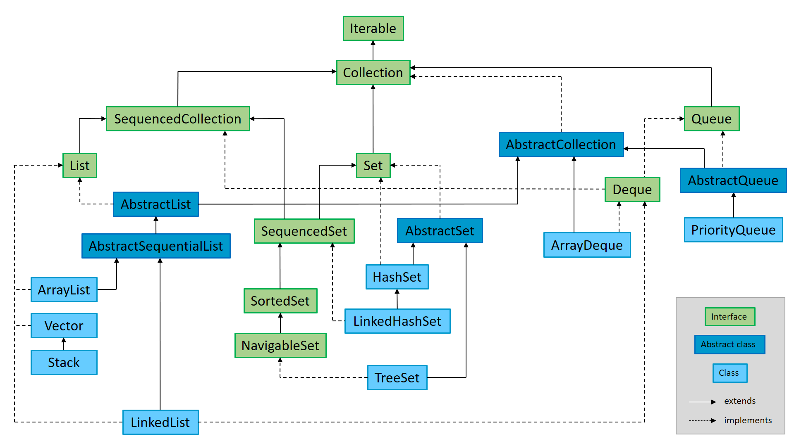

# Java Collection Framework Diagram



### Interface 'Iterable'

The **Iterable** interface is the top-level interface in the Java Collection Framework hierarchy. It represents a collection of elements that can be traversed sequentially, one element at a time. The main purpose of this interface is to provide a standardized way to allow objects to be the target of the enhanced for-each loop introduced in Java 5.

**Iterable** defines a single abstract method:

```
Iterator<T> iterator();
```

This method returns an Iterator<T> that provides the mechanism to iterate over the elements in the collection. The returned iterator allows traversal using methods like hasNext() and next().

Any class that implements **Iterable** can be used in a for-each loop. All major collection types in Java, such as List, Set, and Queue, implement the **Iterable** interface, making them compatible with enhanced for-loops. While the Map interface itself does not directly implement Iterable, its key set (keySet()), value collection (values()), and entry set (entrySet()) do, enabling iteration over keys, values, or key-value pairs.

