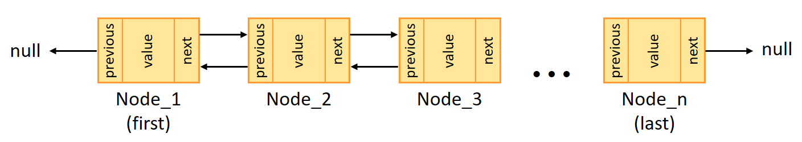
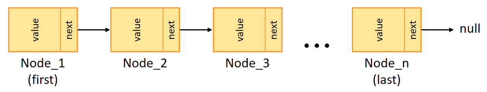

# Java Collection Framework Diagram

<p align="center">
  
  <br>
  <em>Figure 1: Java Collection Framework diagram</em>
</p>

### Class 'ArrayList'

See [official documentation](https://docs.oracle.com/javase/8/docs/api/java/util/ArrayList.html) and [my implementation](src/main/java/collection/MyArrayList.java).

**ArrayList** is a resizable array implementation of the **List** interface. Internally, it uses a dynamically growing array to store elements.

<p align="center">
  
  <br>
  <em>Figure 2: ArrayList structure</em>
</p>

**ArrayList** is based on a regular array, the initial length is 10 by default, but can be changed using one of the constructors. When the array size is exceeded, its capacity is increased by about 50% using the grow() method:

```
int newCapacity = oldCapacity + (oldCapacity >> 1);
```

 - All elements of the array are indexed, which allows accessing (the *get(index)* method) any element in constant time O(1).
 - The operations of inserting an element at the end of the array, as well as removing an element from the end of the array, are also performed in constant time O(1).
 - When an element is added not to the end of the array or one of the elements is removed not from the end of the array, all elements with a higher index are shifted to the right/left, so these operations are performed in O(n) time.
 - Search operations (indexOf, contains) are also performed for linear time O(n).

**ArrayList** is best suited for frequent access operations and when insertions/removals happen mostly at the end.


### Class 'LinkedList'

See [official documentation](https://docs.oracle.com/javase/8/docs/api/java/util/LinkedList.html) and [my implementation](src/main/java/collection/MyLinkedList.java).

**LinkedList** is a doubly-linked list implementation of the **List** interface. Internally, it consists of nodes where each node stores a reference to both the previous and the next node, as well as the element itself.

<p align="center">
  
  <br>
  <em>Figure 3: Doubly-linked list structure (Java realization)</em>
</p>

<p align="center">
  
  <br>
  <em>Figure 4: Singly-linked list structure (for comparison)</em>
</p>

Unlike ArrayList, which uses a contiguous array, **LinkedList** stores elements in nodes that are linked together. This allows efficient insertion and removal at both ends of the list and in the middle, but at the cost of slower random access.

 - Accessing an element by index (the get(index) method) requires traversing the list from the beginning or end, depending on the index position — this takes O(n) time.
 - Adding or removing elements at the beginning or end of the list takes O(1) time, because it only requires updating a few references.
 - Inserting or removing an element in the middle of the list also takes O(n) time due to traversal.
 - Search operations (indexOf, contains) require linear time O(n) as well.

**LinkedList** is best suited for scenarios where frequent insertions and deletions happen at the beginning or end of the list, or when you need to work with iterators.


### Class 'Vector'

See [official documentation](https://docs.oracle.com/javase/8/docs/api/java/util/Vector.html) and [my implementation](src/main/java/collection/MyVector.java).

**Vector** is a legacy implementation of the **List** interface, similar in structure and behavior to **ArrayList**. Internally, it uses a dynamically resizable array to store elements.

Unlike ArrayList, **Vector** is synchronized, meaning that all its methods are thread-safe. Each method call (such as add, remove, get) is wrapped with the *synchronized* keyword to ensure mutual exclusion between threads.

However, this design choice leads to performance overhead in single-threaded or low-contention environments. That’s one of the key reasons why **Vector** is considered obsolete and rarely used today. For thread-safe alternatives, it is recommended to use the following ways:

- Collections.synchronizedList(new ArrayList<>()) – if basic synchronization is needed
- CopyOnWriteArrayList – for high-concurrency, mostly-read scenarios

Key points:

 - Same internal structure as ArrayList: a growable array.
 - Capacity increases approximately by doubling when exceeded.
 - Synchronization ensures thread safety but reduces performance.
 - All operations (e.g., get(index), add(element), remove(index)) have the same time complexity as in ArrayList.

**Vector** is maintained for backward compatibility with legacy code.


### Interface 'Iterable'

See [official documentation](https://docs.oracle.com/javase/8/docs/api/java/lang/Iterable.html).

The **Iterable** interface is the top-level interface in the Java Collection Framework hierarchy. It represents a collection of elements that can be traversed sequentially, one element at a time. The main purpose of this interface is to provide a standardized way to allow objects to be the target of the enhanced for-each loop introduced in Java 5.

**Iterable** defines a single abstract method:

```
Iterator<T> iterator();
```

This method returns an Iterator<T> that provides the mechanism to iterate over the elements in the collection. The returned iterator allows traversal using methods like hasNext() and next().

Any class that implements **Iterable** can be used in a for-each loop. All major collection types in Java, such as List, Set, and Queue, implement the **Iterable** interface, making them compatible with enhanced for-loops. While the Map interface itself does not directly implement Iterable, its key set (keySet()), value collection (values()), and entry set (entrySet()) do, enabling iteration over keys, values, or key-value pairs.

