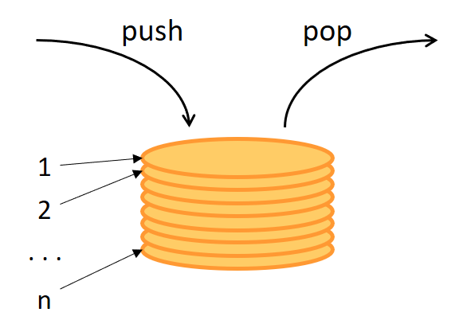

# Java Collection Framework Diagram

<p align="center">
  
  <br>
  <em>Figure 1: Java Collection Framework diagram</em>
</p>


## Table of Contents

- [1. List – Ordered, indexed collection with duplicates allowed](#1-list--ordered-indexed-collection-with-duplicates-allowed)
    - [1.1. Class 'ArrayList'](#11-class-arraylist)
    - [1.2. Class 'LinkedList'](#12-class-linkedlist)
    - [1.3. Class 'Vector'](#13-class-vector)
    - [1.4. Class 'Stack'](#14-class-stack)
    - [1.5. Abstract class 'AbstractList'](#15-abstract-class-abstractlist)
    - [1.6. Abstract class 'AbstractSequentialList'](#16-abstract-class-abstractsequentiallist)
    - [1.7. Interface 'List'](#17-interface-list)
- [2. Set – Unordered collection with unique elements](#2-set--unordered-collection-with-unique-elements)
    - [2.1. Class 'HashSet'](#21-class-hashset)
    - [2.2. Class 'LinkedHashSet'](#22-class-linkedhashset)
    - [2.3. Class 'TreeSet'](#23-class-treeset)
    - [2.4. Abstract class 'AbstractSet'](#24-abstract-class-abstractset)
    - [2.5. Interface 'NavigableSet'](#25-interface-navigableset)
    - [2.6. Interface 'SortedSet'](#26-interface-sortedset)
    - [2.7. Interface 'SequencedSet'](#27-interface-sequencedset)
    - [2.8. Interface 'Set'](#28-interface-set)
- [3. Queue – FIFO structure for ordered element processing](#3-queue--fifo-structure-for-ordered-element-processing)
    - [3.1. Class 'ArrayDeque'](#31-class-arraydeque)
    - [3.2. Interface 'Deque'](#32-interface-deque)
    - [3.3. Class 'PriorityQueue'](#33-class-priorityqueue)
    - [3.4. Abstract class 'AbstractQueue'](#34-abstract-class-abstractqueue)
    - [3.5. Interface 'Queue'](#35-interface-queue)
- [4. Collection – Root interface for all collection types](#4-collection--root-interface-for-all-collection-types)
    - [4.1. Abstract class 'AbstractCollection'](#41-abstract-class-abstractcollection)
    - [4.2. Interface 'SequencedCollection'](#42-interface-sequencedcollection)
    - [4.3. Interface 'Collection'](#43-interface-collection)
- [5. Interface 'Iterable' – Provides iterator for enhanced-for loop](#5-interface-iterable--provides-iterator-for-enhanced-for-loop)


## 1. List – Ordered, indexed collection with duplicates allowed

### 1.1. Class 'ArrayList'

See [official documentation](https://docs.oracle.com/javase/8/docs/api/java/util/ArrayList.html) and [my implementation](src/main/java/collection/MyArrayList.java).

**ArrayList** is a resizable array implementation of the **List** interface. Internally, it uses a dynamically growing array to store elements.

<p align="center">
  
  <br>
  <em>Figure 2: ArrayList structure</em>
</p>

**ArrayList** is based on a regular array, the initial length is 10 by default, but can be changed using one of the constructors. When the array size is exceeded, its capacity is increased by about 50% using the grow() method:

```
int newCapacity = oldCapacity + (oldCapacity >> 1);
```

 - All elements of the array are indexed, which allows accessing (the *get(index)* method) any element in constant time O(1).
 - The operations of inserting an element at the end of the array, as well as removing an element from the end of the array, are also performed in constant time O(1).
 - When an element is added not to the end of the array or one of the elements is removed not from the end of the array, all elements with a higher index are shifted to the right/left, so these operations are performed in O(n) time.
 - Search operations (indexOf, contains) are also performed for linear time O(n).

**ArrayList** is best suited for frequent access operations and when insertions/removals happen mostly at the end.


### 1.2. Class 'LinkedList'

See [official documentation](https://docs.oracle.com/javase/8/docs/api/java/util/LinkedList.html) and [my implementation](src/main/java/collection/MyLinkedList.java).

**LinkedList** is a doubly-linked list implementation of the **List** interface. Internally, it consists of nodes where each node stores a reference to both the previous and the next node, as well as the element itself.

<p align="center">
  
  <br>
  <em>Figure 3: Doubly-linked list structure (Java realization)</em>
</p>

<p align="center">
  
  <br>
  <em>Figure 4: Singly-linked list structure (for comparison)</em>
</p>

Unlike ArrayList, which uses a contiguous array, **LinkedList** stores elements in nodes that are linked together. This allows efficient insertion and removal at both ends of the list and in the middle, but at the cost of slower random access.

 - Accessing an element by index (the get(index) method) requires traversing the list from the beginning or end, depending on the index position — this takes O(n) time.
 - Adding or removing elements at the beginning or end of the list takes O(1) time, because it only requires updating a few references.
 - Inserting or removing an element in the middle of the list also takes O(n) time due to traversal.
 - Search operations (indexOf, contains) require linear time O(n) as well.

**LinkedList** is best suited for scenarios where frequent insertions and deletions happen at the beginning or end of the list, or when you need to work with iterators.


### 1.3. Class 'Vector'

See [official documentation](https://docs.oracle.com/javase/8/docs/api/java/util/Vector.html) and [my implementation](src/main/java/collection/MyVector.java).

**Vector** is a legacy implementation of the **List** interface, similar in structure and behavior to **ArrayList**. Internally, it uses a dynamically resizable array to store elements.

Unlike ArrayList, **Vector** is synchronized, meaning that all its methods are thread-safe. Each method call (such as add, remove, get) is wrapped with the *synchronized* keyword to ensure mutual exclusion between threads.

However, this design choice leads to performance overhead in single-threaded or low-contention environments. That’s one of the key reasons why **Vector** is considered obsolete and rarely used today. For thread-safe alternatives, it is recommended to use the following ways:

- Collections.synchronizedList(new ArrayList<>()) – if basic synchronization is needed
- CopyOnWriteArrayList – for high-concurrency, mostly-read scenarios

Key points:

 - Same internal structure as ArrayList: a growable array.
 - Capacity increases approximately by doubling when exceeded.
 - Synchronization ensures thread safety but reduces performance.
 - All operations (e.g., get(index), add(element), remove(index)) have the same time complexity as in ArrayList.

**Vector** is maintained for backward compatibility with legacy code.


### 1.4. Class 'Stack'

See [official documentation](https://docs.oracle.com/javase/8/docs/api/java/util/Stack.html) and [my implementation](src/main/java/collection/MyStack.java).

The **Stack** class represents a Last-In-First-Out (LIFO) stack of objects. It extends the legacy **Vector** class and provides methods to operate on the stack structure.

**Stack** was added in Java 1.0 — at that time there were no **List**, **Collection**, **Deque** interfaces, and the Java Collections Framework architecture did not exist yet. **Vector** was the basic dynamic array with built-in synchronization, and **Stack** simply inherited it, adding the Last-In-First-Out (LIFO) behavior.

This is now considered a deprecated solution, and **Deque** (e.g. **ArrayDeque**) is recommended for new stack implementations.

All **Vector** methods (e.g. add(), remove(int index)) are also available in **Stack**, but they may break the LIFO logic.

<p align="center">
  
  <br>
  <em>Figure 5: Stack as a LIFO structure</em>
</p>

**Stack** is built on top of Vector, so it inherits all its properties, including dynamic resizing and indexed access. However, unlike **Vector**, it is used in a strictly LIFO manner and exposes a limited set of stack-specific methods:

 - push(E item) – adds an element to the top of the stack.
 - pop() – removes and returns the top element of the stack. Throws *EmptyStackException* if the stack is empty.
 - peek() – returns the top element without removing it. Also throws *EmptyStackException* if empty.
 - isEmpty() – returns *true* if the stack contains no elements and *false* otherwise.
 - search(Object o) – returns the 1-based position from the top of the stack of the first occurrence of the element, or -1 if this element is not present in the stack.

Internally, since **Stack** is based on Vector, all operations like push, pop, and peek rely on indexed access:

 - push is implemented as addElement(item).
 - pop removes the element at size() - 1.
 - peek accesses the element at size() - 1.

Although **Stack** is fully synchronized due to its inheritance from **Vector**, it is considered legacy. Modern Java code prefers **Deque** (e.g., **ArrayDeque**) for stack-like behavior, as it offers better performance and flexibility without legacy synchronization overhead.


### 1.5. Abstract class 'AbstractList'

See [official documentation](https://docs.oracle.com/javase/8/docs/api/java/util/AbstractList.html).

**AbstractList** is an abstract class that partially implements the **List** interface. It serves as a convenience base class for list implementations like **ArrayList** and **Vector**.

It provides default implementations for many commonly used methods such as *isEmpty()*, *addAll()*, *contains()*, *equals()*, and others. These implementations rely on the assumption that the subclass provides working versions of at least a few core methods like *get(int index)*, *size()*, and, optionally, *set(int index, E element)* and *add(int index, E element)*. This allows developers to implement custom list classes without having to re-write all the logic required by the **List** interface.
Instead, they can extend **AbstractList** and only focus on implementing the essential, structure-specific operations.

That is, in simple words, the **List** interface contains a lot of methods. At the same time, some of these methods are already implemented in **AbstractList**, and then only the remaining ones need to be implemented in **ArrayList** and **Vector**, and those methods that are implemented in **AbstractList** will be available in **ArrayList** and **Vector** automatically.

**AbstractList** is best suited for lists with efficient random access (like array-backed structures).


### 1.6. Abstract class 'AbstractSequentialList'

See [official documentation](https://docs.oracle.com/javase/8/docs/api/java/util/AbstractSequentialList.html).

**AbstractSequentialList** is an abstract subclass of **AbstractList** that is optimized for *sequential access* rather than *random access*.

Unlike **AbstractList**, which expects subclasses to provide access to elements by index (via *get(int index)*), **AbstractSequentialList** is designed for data structures like linked lists, where indexed access is slow. Instead, it requires subclasses to implement *listIterator(int index)* and *size()*. By overriding just these two methods, **AbstractSequentialList** automatically provides working implementations of other **List** methods (like get, set, add, remove, etc.) using a **ListIterator** under the hood, which traverses the list sequentially.

It is the base class for **LinkedList**, which relies on a doubly linked list structure, where random access is inefficient but sequential traversal is fast.


### 1.7. Interface 'List'

See [official documentation](https://docs.oracle.com/javase/8/docs/api/java/util/List.html) and [my implementation](src/main/java/collection/MyList.java).

The **List** interface is part of the Java Collections Framework and represents an ordered collection of elements. It allows duplicate elements and provides precise control over where each element is inserted. Elements can be accessed by their integer index, making it suitable for use cases where order and position matter.

Key characteristics:
 - Maintains insertion order.
 - Supports duplicate elements.
 - Provides indexed access (*get(int index)*).
 - Allows positional insertions and deletions.

**List** is suitable when:
 - Element order is important.
 - You need random access or position-based operations.
 - Duplicate elements are allowed.

## 2. Set – Unordered collection with unique elements

### 2.1. Class 'HashSet'

See [official documentation](https://docs.oracle.com/javase/8/docs/api/java/util/HashSet.html) and [my implementation](src/main/java/collection/MyHashSet.java).

**HashSet** is a hash table–based implementation of the **Set** interface. It stores unique elements and provides efficient operations such as add, remove, and contains.
Internally, **HashSet** uses a **HashMap** to store its elements (see the [HashMap documentation](Map_Structure.md#11-class-hashmap)) — each element is stored as a key in the map, and all values are replaced with a constant placeholder object:

```
private transient HashMap<E, Object> map;
private static final Object PRESENT = new Object();
```

This design ensures that all elements in a **HashSet** are unique, and provides the following characteristics:

 - Constant-time performance O(1) for basic operations like add, remove, and contains (on average).
 - Does not guarantee any specific iteration order of elements.
 - Allows the *null* element (only one).
 - Backed by a hash table; internally uses hashing and singly linked lists (or tree bins in Java 8+ if number of collisions exceeds 8).

**HashSet** is ideal for scenarios where you need a fast, unordered collection of unique elements.

### 2.2. Class 'LinkedHashSet'

**LinkedHashSet** is a hash table–based implementation of the **Set** interface that maintains a predictable iteration order. It extends **HashSet** and preserves the insertion order of elements by maintaining a doubly linked list across all elements. Internally, **LinkedHashSet** relies on a **LinkedHashMap** to store its elements. Each element is stored as a key in the map, and the value is a constant placeholder.

This setup creates two internal structures:
 - A hash table for fast lookup, insertion, and deletion (via the underlying **LinkedHashMap**).
 - A doubly linked list to maintain insertion order, enabling ordered iteration.

Key characteristics of **LinkedHashSet**:
 - Maintains insertion order (unlike **HashSet**).
 - Does not allow duplicate elements.
 - Allows at most one null element.
 - Time complexity:
   - add(), remove(), contains() — O(1) on average.
   - ordered iteration — O(n), in insertion order.
 - Not synchronized.

**LinkedHashSet** is useful when you need the performance of a hash set but also want to preserve the order in which elements were added — for example, in cases where consistent iteration order matters, such as exporting, caching, or display logic.

### 2.3. Class 'TreeSet'

### 2.4. Abstract class 'AbstractSet'

See [official documentation](https://docs.oracle.com/javase/8/docs/api/java/util/AbstractSet.html)

**AbstractSet** is an abstract base class for implementations of the **Set** interface. It extends **AbstractCollection** and provides skeletal implementations for common **Set** behavior, reducing the effort required to implement a custom **Set**.

**AbstractSet** is not meant to be used directly — it is intended to be subclassed by concrete Set implementations such as **HashSet**, **TreeSet**, and **LinkedHashSet**.

This class contains only three methods:
 - equals(Object) to compare sets by element equality, not order or identity.
 - hashCode() to return the sum of the hash codes of the set's elements, as required by the **Set** contract.
 - default implementation of removeAll(Collection).

**AbstractSet** inherits common collection behavior (like addAll(), toArray(), etc.) from AbstractCollection.

**AbstractSet** simplifies the creation of **Set** classes by handling structural equality, hash code consistency, and bulk operations out of the box.

### 2.5. Interface 'NavigableSet'

### 2.6. Interface 'SortedSet'

### 2.7. Interface 'SequencedSet'

### 2.8. Interface 'Set'

See [official documentation](https://docs.oracle.com/javase/8/docs/api/java/util/Set.html) and [my implementation](src/main/java/collection/MySet.java).

The **Set** interface represents a collection of unique elements — it does not allow duplicates. It extends the **Collection** interface and preserves most of its behavior, but redefines it to enforce the uniqueness constraint.

Key characteristics of **Set**:
 - Contains no duplicate elements: adding an already existing element has no effect.
 - Based on equals() and hashCode() to determine uniqueness.
 - Provides standard collection operations (add, remove, contains, etc.), but all adapted to the uniqueness constraint.
 - Does not provide positional access (no *get(index)*).

Use **Set** when you need to store a group of unique values and order or index access is not required.

## 3. Queue – FIFO structure for ordered element processing

### 3.1. Class 'ArrayDeque'

### 3.2. Interface 'Deque'

### 3.3. Class 'PriorityQueue'

### 3.4. Abstract class 'AbstractQueue'

### 3.5. Interface 'Queue'

## 4. Collection – Root interface for all collection types

### 4.1. Abstract class 'AbstractCollection'

### 4.2. Interface 'SequencedCollection'

### 4.3. Interface 'Collection'

## 5. Interface 'Iterable' – Provides iterator for enhanced-for loop

See [official documentation](https://docs.oracle.com/javase/8/docs/api/java/lang/Iterable.html).

The **Iterable** interface is the top-level interface in the Java Collection Framework hierarchy. It represents a collection of elements that can be traversed sequentially, one element at a time. The main purpose of this interface is to provide a standardized way to allow objects to be the target of the enhanced for-each loop introduced in Java 5.

**Iterable** defines a single abstract method:

```
Iterator<T> iterator();
```

This method returns an Iterator<T> that provides the mechanism to iterate over the elements in the collection. The returned iterator allows traversal using methods like hasNext() and next().

Any class that implements **Iterable** can be used in a for-each loop. All major collection types in Java, such as List, Set, and Queue, implement the **Iterable** interface, making them compatible with enhanced for-loops. While the Map interface itself does not directly implement Iterable, its key set (keySet()), value collection (values()), and entry set (entrySet()) do, enabling iteration over keys, values, or key-value pairs.

