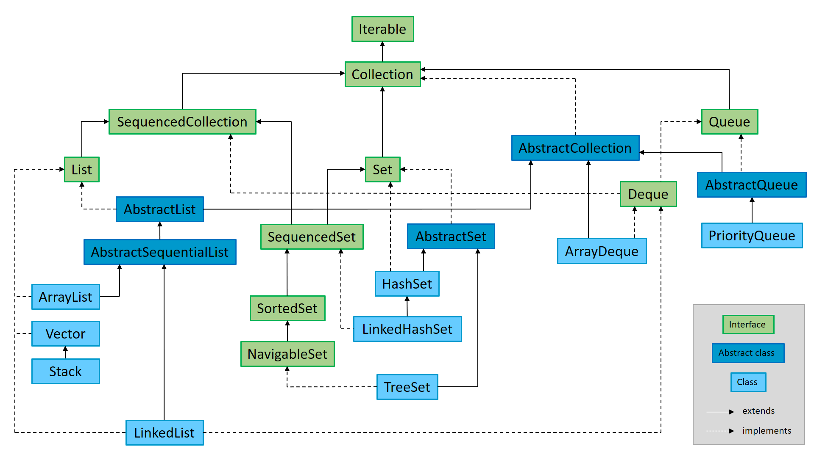
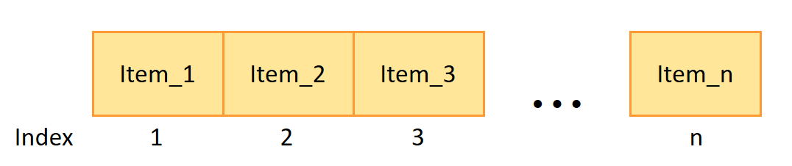

# Java Collection Framework Diagram

<p align="center">
  
  <br>
  <em>Figure 1: Java Collection Framework diagram</em>
</p>

### Class 'ArrayList'

See [official documentation](https://docs.oracle.com/javase/8/docs/api/java/util/ArrayList.html) and [my implementation](src/main/java/collection/MyArrayList.java).

**ArrayList** is a resizable array implementation of the **List** interface. Internally, it uses a dynamically growing array to store elements.

<p align="center">
  
  <br>
  <em>Figure 2: ArrayList structure</em>
</p>

**ArrayList** is based on a regular array, the initial length is 10 by default, but can be changed using one of the constructors. When the array size is exceeded, its capacity is increased by about 50% using the grow() method:

```
int newCapacity = oldCapacity + (oldCapacity >> 1);
```

 - All elements of the array are indexed, which allows accessing (the *get(index)* method) any element in constant time O(1).
 - The operations of inserting an element at the end of the array, as well as removing an element from the end of the array, are also performed in constant time O(1).
 - When an element is added not to the end of the array or one of the elements is removed not from the end of the array, all elements with a higher index are shifted to the right/left, so these operations are performed in O(n) time.
 - Search operations (indexOf, contains) are also performed for linear time O(n).

**ArrayList** is best suited for frequent access operations and when insertions/removals happen mostly at the end.


### Interface 'Iterable'

See [official documentation](https://docs.oracle.com/javase/8/docs/api/java/lang/Iterable.html).

The **Iterable** interface is the top-level interface in the Java Collection Framework hierarchy. It represents a collection of elements that can be traversed sequentially, one element at a time. The main purpose of this interface is to provide a standardized way to allow objects to be the target of the enhanced for-each loop introduced in Java 5.

**Iterable** defines a single abstract method:

```
Iterator<T> iterator();
```

This method returns an Iterator<T> that provides the mechanism to iterate over the elements in the collection. The returned iterator allows traversal using methods like hasNext() and next().

Any class that implements **Iterable** can be used in a for-each loop. All major collection types in Java, such as List, Set, and Queue, implement the **Iterable** interface, making them compatible with enhanced for-loops. While the Map interface itself does not directly implement Iterable, its key set (keySet()), value collection (values()), and entry set (entrySet()) do, enabling iteration over keys, values, or key-value pairs.

