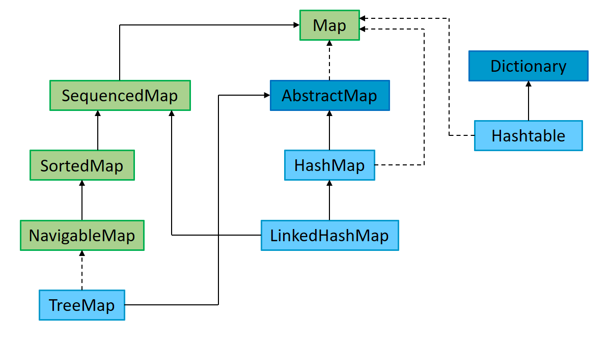
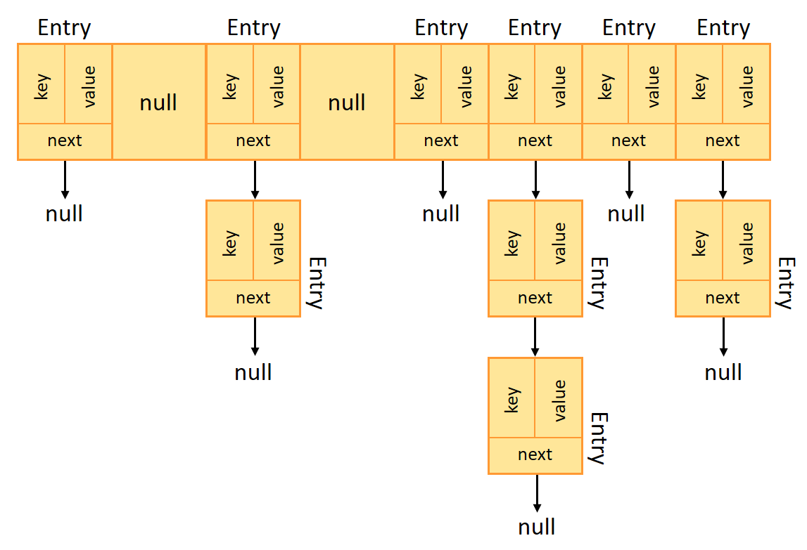

# Map in Java Collection Framework

Although the **Map** interface does not inherit from the **Collection** interface, the **Map** collection hierarchy is part of the Java Collection Framework. But to make it easier to read and understand, this repository has a separate page for the **Map** hierarchy.

<p align="center">
  
  <br>
  <em>Figure 1: Map hierarchy in Java Collection Framework</em>
</p>


## Table of Contents

- [1. Map – Key-value pairs with unique keys](#1-map--key-value-pairs-with-unique-keys)
    - [1.1. Class 'HashMap'](#11-class-hashmap)
    - [1.2. Class 'LinkedHashMap'](#12-class-linkedhashmap)
    - [1.3. Class 'TreeMap'](#13-class-treemap)
    - [1.4. Abstract class 'AbstractMap'](#14-abstract-class-abstractmap)
    - [1.5. Interface 'SequencedMap'](#15-interface-sequencedmap)
    - [1.6. Interface 'SortedMap'](#16-interface-sortedmap)
    - [1.7. Interface 'NavigableMap'](#17-interface-navigablemap)
    - [1.8. Class 'Hashtable'](#18-class-hashtable)
    - [1.9. Abstract class 'Dictionary'](#19-abstract-class-dictionary)
    - [1.10. Interface 'Map'](#110-interface-map)


## 1. Map – Key-value pairs with unique keys

### 1.1. Class 'HashMap'

See [official documentation](https://docs.oracle.com/javase/8/docs/api/java/util/HashMap.html) and [my implementation](src/main/java/collection/MyHashMap.java).

**HashMap** is a hash table–based implementation of the **Map** interface. It stores key-value pairs and allows efficient retrieval, insertion, and deletion based on keys.

<p align="center">
  
  <br>
  <em>Figure 2: HashMap structure</em>
</p>

Internally, **HashMap** uses an array of buckets (of the type of the internal **Entry** class), where each bucket is a linked list (or a balanced tree for high-collision cases). The position of each key in the array is determined by applying the hashCode() of the key and then compressing it using modulo or bit manipulation:

```
index = hash(key) % capacity;
```

Key characteristics of **HashMap**:

 - Allows null keys and values (only one null key allowed).
 - Unordered: does not maintain insertion order.
 - Not synchronized: must be manually synchronized for thread safety.
 - Time complexity:
   - put(), get(), remove() — average case: O(1), worst case: O(n) (or O(log n) with tree bins).
   - containsKey() / containsValue() — O(1) / O(n).

**HashMap** is the default choice for most use cases when fast access by key is required and order does not matter.

### 1.2. Class 'LinkedHashMap'

### 1.3. Class 'TreeMap'

### 1.4. Abstract class 'AbstractMap'

### 1.5. Interface 'SequencedMap'

### 1.6. Interface 'SortedMap'

### 1.7. Interface 'NavigableMap'

### 1.8. Class 'Hashtable'

### 1.9. Abstract class 'Dictionary'

### 1.10. Interface 'Map'


